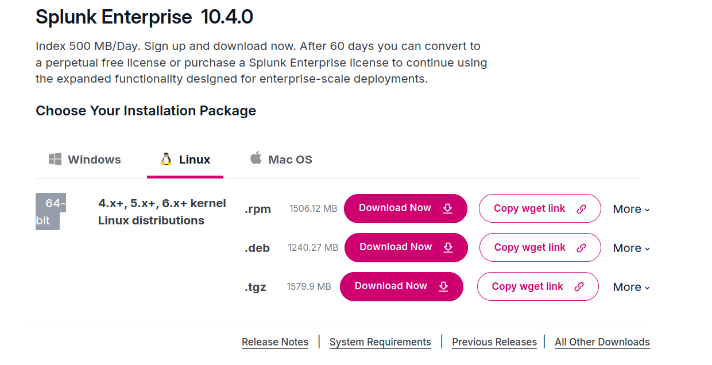
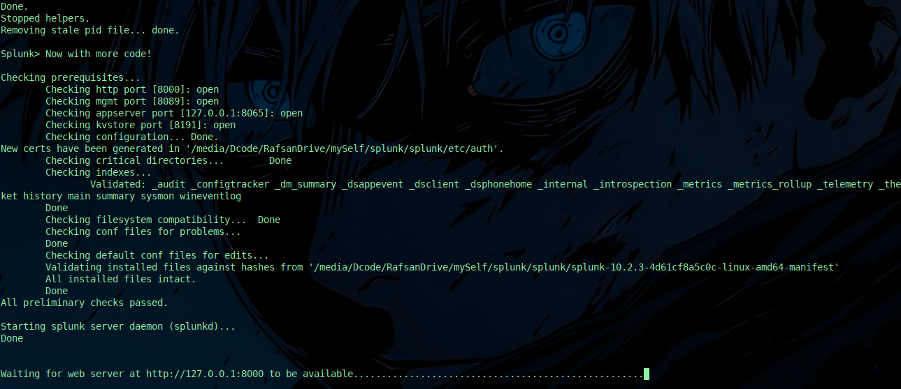
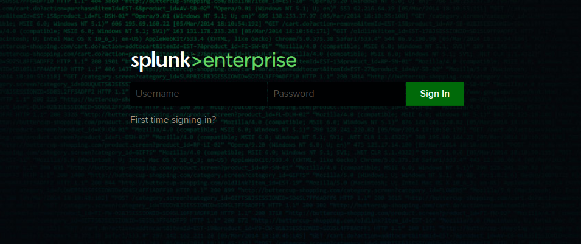
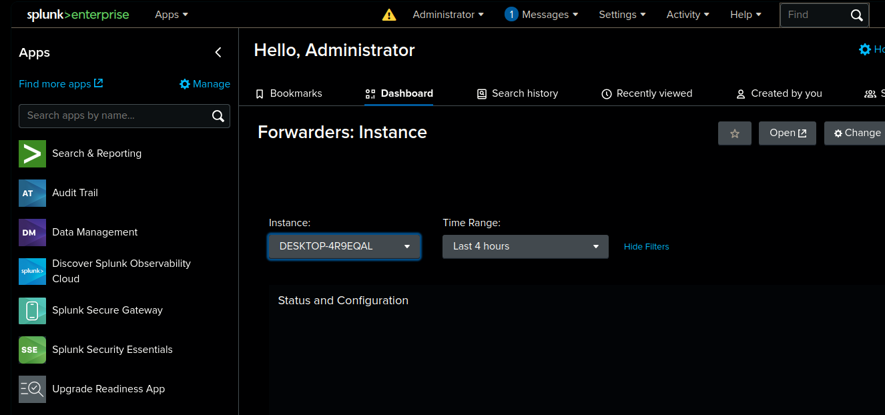
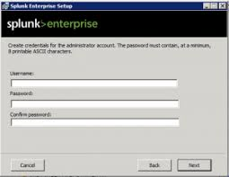
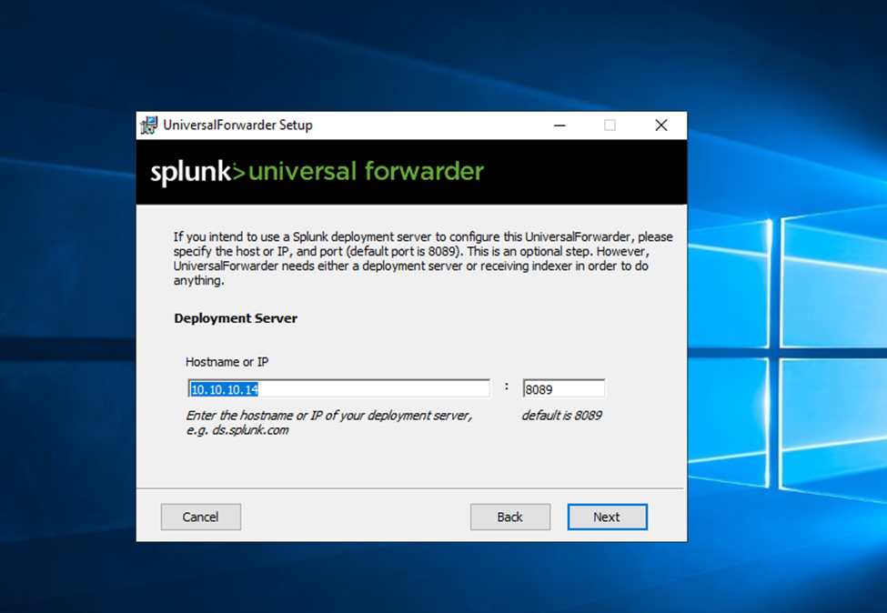
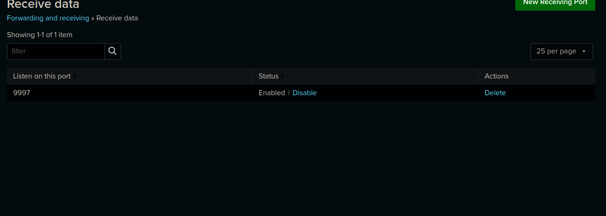
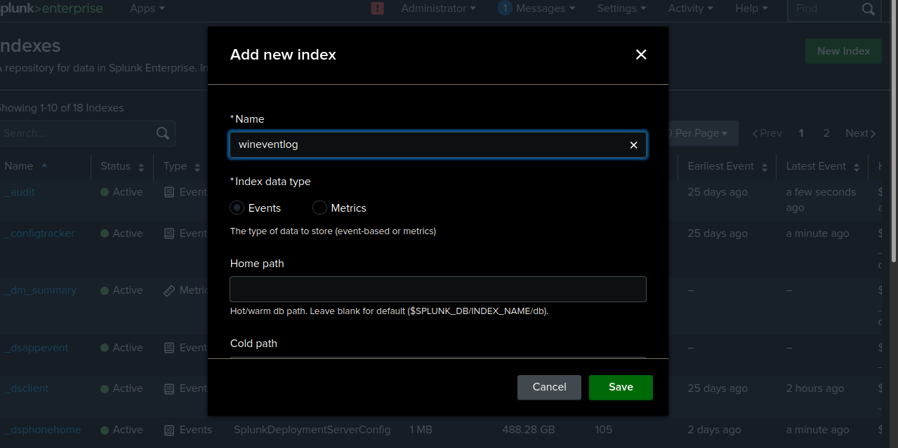
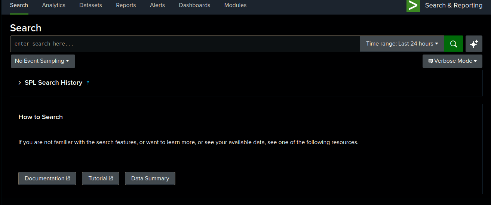
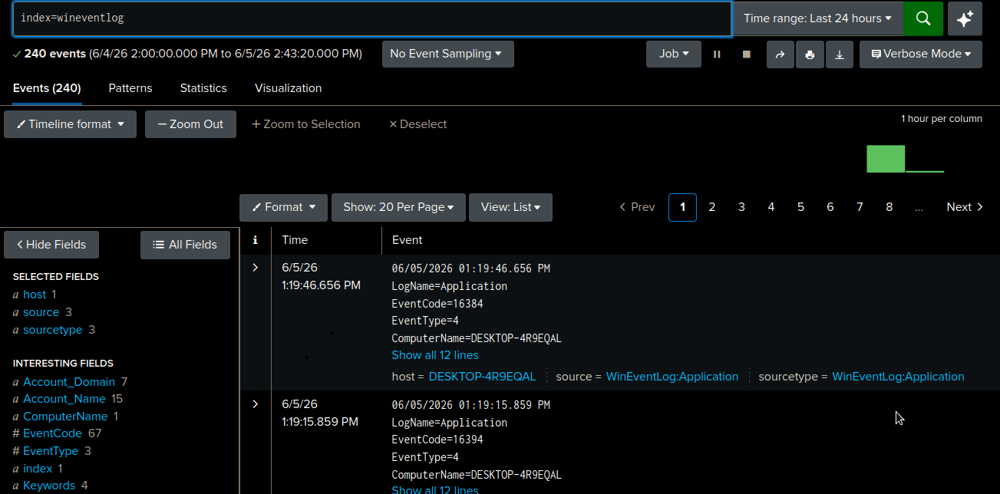

## 🛡️ About Splunk as a SIEM Solution

Splunk is an industry-leading **SIEM (Security Information and Event Management)** platform designed to provide comprehensive, real-time security visibility across enterprise infrastructures. By indexing massive streams of machine data, Splunk empowers Security Operations Centers (SOCs) to monitor, detect, analyze, and respond to threats at scale.

---

### 🚀 Key Capabilities

* **Data Ingestion & Indexing:** Consumes multi-structured data from virtually any source (firewalls, endpoints, cloud infrastructure, OS logs) without requiring predefined schemas.
* **Advanced Threat Detection:** Utilizes the **Splunk Search Processing Language (SPL)** to build complex queries, correlate disparate logs, and uncover sophisticated attack patterns.
* **Real-Time Alerting & Dashboards:** Transforms raw logs into actionable visualization panels and triggers automated alerts when anomalous behavior or known Indicators of Compromise (IoCs) are detected.
* **Incident Response & SOAR:** Integrates with Splunk SOAR (Security Orchestration, Automation, and Response) to automate playbooks and minimize Mean Time to Respond (MTTR).

---

### 🏗️ Core Architecture Components

To build an efficient pipeline, a typical Splunk SIEM deployment relies on a tiered architecture:

| Component | Role | Function |
| :--- | :--- | :--- |
| **Forwarders (UF/HF)** | Data Collection | Lightweight agents deployed on endpoints/servers to collect and send logs. |
| **Indexers** | Storage & Processing | Receives, parses, indexes, and stores the incoming log data. |
| **Search Heads** | User Interface | The frontend tier where analysts write SPL queries, build dashboards, and manage alerts. |

---

> 💡 **Why Splunk?** > In a modern security landscape, visibility is everything. Splunk bridges the gap between massive, fragmented log data and actionable threat intelligence, acting as the centralized "brain" of defensive cybersecurity operations.


# LAB SETUP GUIDE 

### 🏗️ Environment Setup & Prerequisites

Before beginning the configuration, ensure your environment matches or meets the minimum requirements outlined below:

#### 🖥️ Host Machine (Splunk Enterprise / Receiver)
* **Operating System:** Xubuntu 24.04.4 LTS x86_64
* **Role:** Splunk Enterprise Server Deployment

#### 💻 Target Virtual Machine (Splunk Universal Forwarder)
* **Operating System:** Windows 7 (x64) or higher
* **Role:** Endpoint Log Collection

> 💡 **Resource Optimization:** If you are running a low-spec lab environment, you can utilize lightweight Windows ISOs to minimize RAM and CPU overhead. Recommended lightweight versions include:
> * [Windows X-Lite](https://windowsxlite.com/)
> * [Windows 10 Lite Edition via Archive.org](https://archive.org/details/windows-10-lite-edition-19h2-x64)


# 🖥️ Host Machine Setup: Splunk Enterprise (Receiver)

To deploy Splunk Enterprise as your centralized log receiver, follow the registration and installation steps below.

### 📋 Step 1: Create a Splunk Account
1. Head over to the official [Splunk Registration Page](https://www.splunk.com/en_us/form/sign-up.html?module=nav&redirecturl=https://www.splunk.com/).
2. Fill out the required details to create your free account.
3. Verify your registration and log in to the portal.

### 📥 Step 2: Download the Splunk Enterprise Installer
Once logged in, navigate to the [Splunk Enterprise Download Center](https://www.splunk.com/en_us/download/splunk-enterprise.html) to choose the package optimized for your operating system.



> 💡 **Xubuntu/Linux Users:** > Because i am using `Xubuntu 24.04` environment, select the **Linux** tab and download the `.tar` Pakage.

```bash
tar -xfv {filename}.tar
```
Once the download is complete, extract the contents of the archive and navigate to the Splunk binary directory to begin configuration:

1. Extract the `.tgz` or `.tar` archive to your desired installation directory.
2. Open your terminal and change your directory to `splunk/bin`:

```bash
cd /path/to/extracted/splunk/bin
./splunk start --accept-license
```
Upon running the startup command, the installer will prompt you to configure your administrator credentials:

1. **Create Administrator Username:** Enter a secure username (e.g., `admin`).
2. **Create Administrator Password:** Enter and confirm a strong password.

Once the initialization process completes, your Splunk instance will be live and accessible via your web browser at:

👉 **[http://localhost:8000](http://localhost:8000)**



After All done you Get the Splunk Dashboard ready to go.



Then Login with credentials you created during the initial setup phase. 



Succesfully Installed !!! Splunk Enterprise .

# 🖥️ Forwader Machine Setup: Splunk Forwader (Log Sender or Agent)

For the forwarder node, a VirtualBox Windows VM will serve as the target endpoint. We will install the native Splunk Universal Forwarder Windows agent to collect and ship logs to our Xubuntu receiver.

#### 📥 Step 1: Download the Windows Agent
1. Navigate to the official [Splunk Universal Forwarder Download Page](https://www.splunk.com/en_us/download.html). *(Note: If your session has expired, you will be prompted to log back in).*
2. Select the **Windows** tab.
3. Choose the appropriate installer package based on your VM architecture:
   * **Windows 64-bit (x64)** (Recommended)
   * **Windows 32-bit (x86)**

### ⚙️ Step 2: Running the Universal Forwarder Installer

Locate your downloaded `.msi` file inside your Windows VM and execute it to begin the installation wizard.

#### 1️⃣ Define Forwarder Credentials
During the initial phase of the setup wizard, you will be prompted to create administrative credentials. 
* **Username:** Create a local admin account for managing the forwarder agent.
* **Password:** Enter and confirm a strong password.



#### 2️⃣ Configure the Deployment & Receiving Servers
Next, the installer will request network information to establish a connection with your Splunk Enterprise host machine.

* **Deployment Server:** You can leave this blank if you are managing the configuration locally.
* **Receiving Indexer (Splunk Enterprise):** Input the static **IP Address** of your Xubuntu host machine along with the default Splunk indexing port (`9997`).



#### 3️⃣ Complete the Installation
Review your settings, click **Install**, and wait for the wizard to successfully copy all files and initialize the background services on the Windows machine.

# 📡 Configuring Log Communication Between Server and Forwarder

To establish a communication pipeline between your Windows Forwarder and the Xubuntu Splunk Enterprise Server, you must first enable a receiving port on the server machine. By default, Splunk utilizes port `9997` for this traffic.

---

## ⚙️ Step 1: Enable the Receiving Port on Splunk Enterprise

1. Open your web browser and log into your **Splunk Enterprise** instance (`http://localhost:8000`).
2. Navigate to the top navigation bar and click on **Settings** ➔ **Forwarding and receiving**.
3. Under the *Receive data* section, click on **Configure receiving**.
4. Click the **New Receiving Port** button in the top right corner.
5. Enter `9997` in the **Listen on this port** field and click **Save**.



---

### Verification Note
> 🔒 **Port Activation Complete:** Once saved, your Splunk Enterprise instance is officially configured to listen for incoming log streams on port `9997`.

## ⚙️ Step 2: Configure the Splunk Universal Forwarder Active Connection

To finalize the connection from the endpoint side, you must map the Universal Forwarder to your Splunk Enterprise instance using the Windows Command Prompt (CMD).

#### 1️⃣ Open Command Prompt as Administrator
Search for `cmd` in the Windows Start Menu, right-click, and select **Run as administrator**.

#### 2️⃣ Navigate to the Binary Directory and Link the Server
Change your directory to the Splunk installation path and execute the `add forward-server` command:

```cmd
cd "C:\Program Files\SplunkUniversalForwarder\bin"

splunk add forward-server <YOUR_SPLUNK_ENTERPRISE_SERVER_IP>:9997
```
After that need to Configure `inputs.conf`. So open the `C:\Program Files\SplunkUniversalForwarder\etc\system\local\` Directory and Create a file name `inputs.conf`
then pest the following configuration.
```
[WinEventLog://Application]
disabled = false
index= wineventlog

[WinEventLog://System]
disabled = false
index= wineventlog

[WinEventLog://Security]
disabled = false
index= wineventlog

[WinEventLog://Microsoft-Windows-Sysmon/Operational]
index = wineventlog
disabled = false
renderXml = true
source = XmlWinEventLog:Microsoft-Windows-Sysmon/Operational

```
This configuration defines **stanzas** (the headers in brackets) that tell Splunk exactly which Windows Event logs to collect, how to format them, and where to store them.
* **`[WinEventLog://...]`:** Specifies the path of the Windows Event Log channel to monitor (**Application**, **System**, and **Security** logs).
* **`disabled = false`:** Explicitly activates collection for these log channels.
* **`index = wineventlog`:** Routes all collected events into a dedicated storage bucket on your Splunk server named `wineventlog` (this makes searching faster and more organized).
* **`renderXml = true`** *(Sysmon specific)*:** Forces Windows to output **Sysmon** logs in XML format. This preserves the structured layout of complex event fields (like Process IDs and parent command lines), making them much easier for Splunk to parse.
* **`source = XmlWinEventLog:...`** *(Sysmon specific)*:** Modifies the source metadata tag so Splunk knows these specific logs are coming in as structured XML rather than standard plain text.
------
Then Save the Config file and you all set. Becare your Fowader System time and server system time must sync otherwise Logs perphaps now appare. 


## ⚙️ Step 4: Provisioning the Index and Verifying Data Ingestion

To properly store and query the incoming Windows events, you must create a dedicated index on the Splunk Enterprise server that matches the index destination specified in your forwarder's `inputs.conf` file.

---

#### 1️⃣ Create the Target Index (`wineventlog`)
1. Log into your **Splunk Enterprise** dashboard (`http://localhost:8000`).
2. Navigate to the top-right menu and select **Settings** ➔ **Indexes**.
3. Click the **New Index** button in the top right corner.
4. Configure the following parameter:
   * **Index Name:** `wineventlog` *(Note: This must exactly match the index specified in your forwarder configuration)*.
5. Leave all other retention and storage settings at their **Default** values and click **Save**.



---

#### 2️⃣ Navigate to the Search App
1. Click the **Apps** dropdown menu in the top-left section of the sidebar.
2. Select **Search & Reporting** to open the primary analytical interface.



---

#### 3️⃣ Execute Verification Query
To confirm that the data pipeline is fully operational and that the Windows Forwarder is successfully shipping logs, execute an SPL search against your new index:

1. In the search bar, type the following query:
```spl
   index="wineventlog"
```


---

## 🤝 Contributing & Feedback

Thank you for checking out this Splunk deployment guide! If you encountered any issues during your setup, found a typo, or have suggestions on how to improve this lab layout, feel free to open an **Issue** or submit a **Pull Request**. 

If this guide helped you set up your first home lab environment, don't forget to give this repository a ⭐! 

Happy Threat Hunting! 🎯