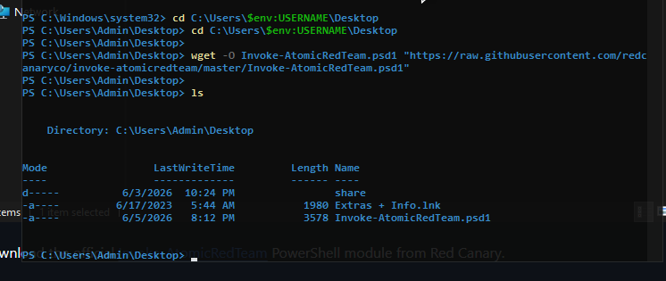
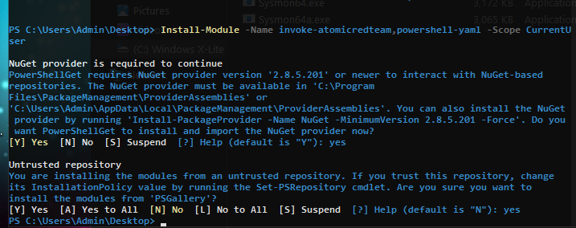
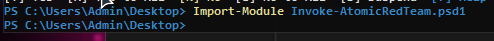
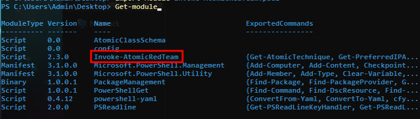
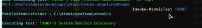

# 🏹 Adversary Emulation with Atomic Red Team (ART)

## 📝 Introduction
**Atomic Red Team** is an open-source framework developed by Red Canary that allows security teams to safely, quickly, and predictably test their defenses against real-world adversary behaviors. Mapped directly to the **MITRE ATT&CK®** matrix, it consists of small, highly targeted automation scripts ("atomics") designed to emulate specific cyber threat techniques—such as credential dumping, persistence, or malicious script execution. By deploying these controlled simulations, defenders can verify if their security infrastructure and SIEM platforms (like Splunk) are successfully capturing, indexing, and alerting on malicious activity.

---

## 🛑 Critical Security Disclaimer & Notice
> ⚠️ **CRITICAL WARNING:** The Atomic Red Team framework contains real-world attack payloads and scriptable behaviors that simulate actual malware. **Execute these tests ONLY inside an isolated, non-production sandbox environment (such as a dedicated virtual machine).** 
> 
> * **Antivirus Intervention:** Real-time protection engines (like Windows Defender) will actively block or quarantine these files because they contain known signature behaviors. You must temporarily disable real-time protection on your target lab VM to ensure the simulations execute properly. **Run completely at your own risk.**

---

## Prerequisites

* Windows PowerShell
* Internet connection
* PowerShell execution policy configured appropriately
* User account with permission to install PowerShell modules

---
## ⚙️ Installation & Setup Process

The core framework and test cases are openly maintained by the security community under the [Red Canary GitHub Organization](https://github.com/redcanaryco/). To set up the atomics library manually on your Windows target endpoint, follow the steps below:

### 📥 Downloading the Atomics Library
You can download the compiled master repository directly from the official source package to your isolated virtual machine.

* **Direct Source Link:** [Download Atomic Red Team Master Archive (.zip)](https://codeload.github.com/redcanaryco/atomic-red-team/zip/refs/heads/master)

After Download Extract this zip file and place on `c:` Drive with the Name `AtomicReadTeam` . It's Nessesary Name like this else code will not work in future.


Download the official [Invoke-AtomicRedTeam](https://github.com/redcanaryco/invoke-atomicredteam) PowerShell module from Red Canary.

### Instructions:

1. **Open PowerShell as Administrator**

```powershell
cd C:\Users\$env:USERNAME\Desktop

wget -O Invoke-AtomicRedTeam.psd1 "https://raw.githubusercontent.com/redcanaryco/invoke-atomicredteam/master/Invoke-AtomicRedTeam.psd1"

```


## Installing and Testing Invoke-AtomicRedTeam (ART)

This guide walks through the installation and verification process for the **Invoke-AtomicRedTeam (ART)** PowerShell module.


### Step 1: Install Required PowerShell Modules

Install the **Invoke-AtomicRedTeam** and **PowerShell-YAML** modules using the following command:

```powershell
Install-Module -Name invoke-atomicredteam,powershell-yaml -Scope CurrentUser
```

> **Note:** An active internet connection is required because PowerShell will download the modules from the PowerShell Gallery.



---

## Step 2: Import the Invoke-AtomicRedTeam Module

After the installation is complete, import the module into your current PowerShell session.

In this example, the module was downloaded to the **Desktop** directory, and PowerShell is currently running from that location.

```powershell
Import-Module Invoke-AtomicRedTeam.psd1
```



If no error messages appear, the module has been imported successfully.

---

## Step 3: Verify Module Installation

Use the following command to confirm that the module is loaded:

```powershell
Get-Module
```



Look for **Invoke-AtomicRedTeam** in the list of loaded modules.

✅ If the module appears in the output, the installation was successful.

---

## Step 4: Run an Atomic Red Team Test

Execute the following Atomic Red Team test:

```powershell
Invoke-AtomicTest T1007
```



If the test executes successfully and you see the expected output, your Atomic Red Team environment is working correctly.

---

## Verification Checklist

* [x] PowerShell modules installed successfully
* [x] Invoke-AtomicRedTeam module imported
* [x] Module visible in `Get-Module`
* [x] Atomic test executed successfully

---

## Conclusion

You have successfully installed and configured **Invoke-AtomicRedTeam (ART)** on your system.

You can now begin running Atomic Red Team tests to simulate adversary techniques and generate telemetry for detection engineering, security monitoring, and SIEM validation.

Happy testing! 🚀
