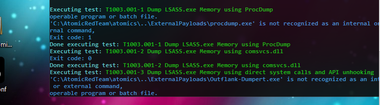
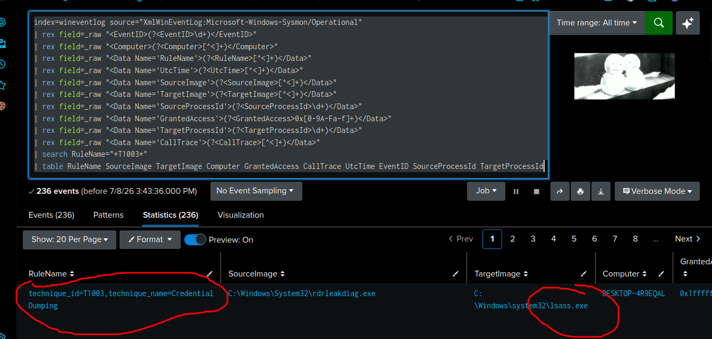

# 🧬 T1003.001 - LSASS Memory Dump

T1003.001 – LSASS Memory is a credential access technique where an attacker dumps the memory of the Local Security Authority Subsystem Service (LSASS) process to extract sensitive credentials, such as plaintext passwords, NTLM hashes, Kerberos tickets, and cached login information. These credentials can then be used for privilege escalation or lateral movement within the network.

MITRE ATT&CK Tactic: Credential Access
Technique ID: T1003.001
Technique Name: LSASS Memory

Cyber Kill Chain Phase:

Actions on Objectives (Credential Theft / Post-Exploitation)

> ⚠️ **Disclaimer:** This project is intended **only** for authorized security testing, academic research, and defensive training. Do **not** use it against systems without explicit written authorization.

## Lab Prerequisites

### Mandatory Requirements

1. A Windows x64 machine with ART Module installed and Splunk Universal Forwarder configured.
2. A fully operational Splunk Server (ready for log ingestion).

### Setup Instructions

You must install the ART Module on the Windows target machine. For step-by-step installation instructions, follow the guide [HERE](https://github.com/rafsanthegeneral/splunkproject/blob/master/project%232-Atomic-Red-Team-Analysis/ART%23SetupModuleOnWindows.md).

### Run the T1003.001 module using powershell 

After succesfully install the ART module you can run the T1003.001 ART module using powershell.
```powershell
Invoke-AtomicTest T1003.001
```


### Detect the attack on splunk dashboard

After successfully configuring Sysmon and forwarding the logs to Splunk, verify that the detection is working.

1. Open the **Splunk Dashboard**.
2. Navigate to **Apps → Search & Reporting**.
3. Run the following SPL query (assuming your Windows event log index is named `wineventlog`).

```
index=wineventlog source="XmlWinEventLog:Microsoft-Windows-Sysmon/Operational"
| rex field=_raw "<EventID>(?<EventID>\d+)</EventID>"
| rex field=_raw "<Computer>(?<Computer>[^<]+)</Computer>"
| rex field=_raw "<Data Name='RuleName'>(?<RuleName>[^<]+)</Data>"
| rex field=_raw "<Data Name='UtcTime'>(?<UtcTime>[^<]+)</Data>"
| rex field=_raw "<Data Name='SourceImage'>(?<SourceImage>[^<]+)</Data>"
| rex field=_raw "<Data Name='TargetImage'>(?<TargetImage>[^<]+)</Data>"
| rex field=_raw "<Data Name='SourceProcessId'>(?<SourceProcessId>\d+)</Data>"
| rex field=_raw "<Data Name='GrantedAccess'>(?<GrantedAccess>0x[0-9A-Fa-f]+)</Data>"
| rex field=_raw "<Data Name='TargetProcessId'>(?<TargetProcessId>\d+)</Data>"
| rex field=_raw "<Data Name='CallTrace'>(?<CallTrace>[^<]+)</Data>"
| search RuleName="*T1003*"
| table RuleName SourceImage TargetImage Computer GrantedAccess CallTrace UtcTime EventID SourceProcessId TargetProcessId
```


| Field | Description |
|-------|-------------|
| `RuleName` | MITRE ATT&CK technique detected |
| `SourceImage` | Process performing the injection |
| `TargetImage` | Process being targeted |
| `Computer` | Host where the event occurred |
| `UtcTime` | Time the event was generated |
| `EventID` | Sysmon Event ID |
| `SourceProcessId` | Source process PID |
| `TargetProcessId` | Target process PID |

So succesfully detect T100.001 Attack the Credential Dumping.!!!
 