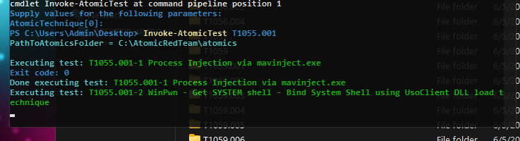
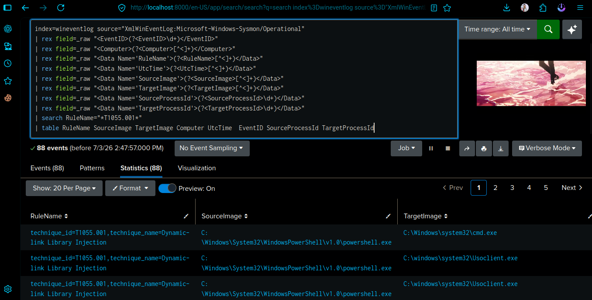
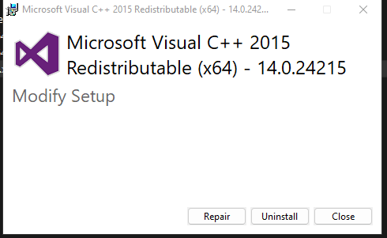
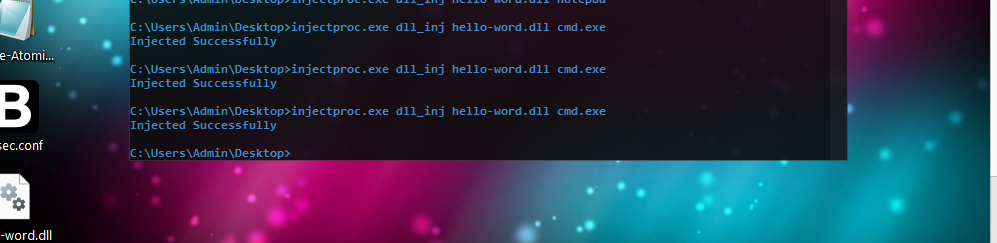
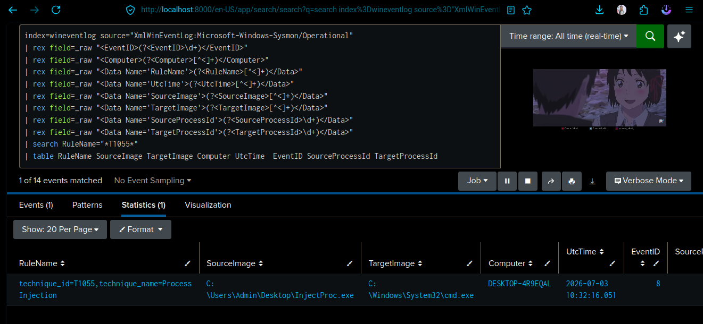

# 🧬 T1055.001 - DLL Injection (Windows)

```markdown
# T1055.001 – Dynamic-Link Library (DLL) Injection

A proof-of-concept (PoC) implementation of **MITRE ATT&CK T1055.001 – Dynamic-Link Library (DLL) Injection** for Windows systems.

**DLL Injection** is a process injection technique that enables an attacker to inject a malicious DLL into the address space of a legitimate running process. By executing code within a trusted process, attackers can evade security controls, blend in with normal system activity, and execute malicious actions with the privileges of the target process.

This technique is commonly used during **post-exploitation** for:
- Privilege escalation
- Defense evasion
- Stealthy code execution
- Malware deployment

**MITRE ATT&CK Tactic:** Defense Evasion / Privilege Escalation  
**Technique ID:** T1055.001 – Dynamic-Link Library Injection


> ⚠️ **Disclaimer:** This project is intended **only** for authorized security testing, academic research, and defensive training. Do **not** use it against systems without explicit written authorization.
```


## Lab Prerequisites

### Mandatory Requirements

1. A Windows x64 machine with ART Module installed and Splunk Universal Forwarder configured.
2. A fully operational Splunk Server (ready for log ingestion).

### Setup Instructions

#### Method 1: Using ART Module

You must install the ART Module on the Windows target machine. For step-by-step installation instructions, follow the guide [HERE](https://github.com/rafsanthegeneral/splunkproject/blob/master/project%232-Atomic-Red-Team-Analysis/ART%23SetupModuleOnWindows.md).

#### Method 2: Using Actual Malicious Files

If you prefer to simulate the attack using real-world payloads rather than ART, download the following components:

| Component | Download Link |
|-----------|---------------|
| Microsoft Visual C++ Redistributable | [Download Here](https://www.microsoft.com/en-us/download/details.aspx?id=53840) |
| InjectProc Module | [Download Here](https://github.com/secrary/InjectProc/releases/download/0.1/InjectProc.exe) |
| DLL Payload | [Download Here](https://github.com/carterjones/hello-world-dll/releases) |

#### [+] Using Method 1: Diploy The ART module windows machine and see the logs and analyze logs into splunk

If you succesfully installed the ART module so you can run the module using this command on the powershell with admin priv.

```powershell
Invoke-AtomicTest T1055.001
```


### Analysis the attack patterns 


After successfully configuring Sysmon and forwarding the logs to Splunk, verify that the detection is working.

1. Open the **Splunk Dashboard**.
2. Navigate to **Apps → Search & Reporting**.
3. Run the following SPL query (assuming your Windows event log index is named `wineventlog`).

```spl
index=wineventlog source="XmlWinEventLog:Microsoft-Windows-Sysmon/Operational"
| rex field=_raw "<EventID>(?<EventID>\d+)</EventID>"
| rex field=_raw "<Computer>(?<Computer>[^<]+)</Computer>"
| rex field=_raw "<Data Name='RuleName'>(?<RuleName>[^<]+)</Data>"
| rex field=_raw "<Data Name='UtcTime'>(?<UtcTime>[^<]+)</Data>"
| rex field=_raw "<Data Name='SourceImage'>(?<SourceImage>[^<]+)</Data>"
| rex field=_raw "<Data Name='TargetImage'>(?<TargetImage>[^<]+)</Data>"
| rex field=_raw "<Data Name='SourceProcessId'>(?<SourceProcessId>\d+)</Data>"
| rex field=_raw "<Data Name='TargetProcessId'>(?<TargetProcessId>\d+)</Data>"
| search RuleName="*T1055.001*"
| table RuleName SourceImage TargetImage Computer UtcTime EventID SourceProcessId TargetProcessId
```

##### Query Explanation

This search performs the following actions:

- Searches the **Sysmon Operational** event log.
- Extracts relevant XML fields from the raw event.
- Filters events matching **MITRE ATT&CK Technique T1055.001 (Dynamic-link Library Injection)**.
- Displays only the important information in a clean table.

The output includes:

| Field | Description |
|-------|-------------|
| `RuleName` | MITRE ATT&CK technique detected |
| `SourceImage` | Process performing the injection |
| `TargetImage` | Process being targeted |
| `Computer` | Host where the event occurred |
| `UtcTime` | Time the event was generated |
| `EventID` | Sysmon Event ID |
| `SourceProcessId` | Source process PID |
| `TargetProcessId` | Target process PID |

### Expected Output

If the DLL injection simulation was successful, the search should return an event similar to the following:

| RuleName | SourceImage | TargetImage | Computer | UtcTime | EventID | SourceProcessId | TargetProcessId |
|----------|-------------|-------------|----------|----------|---------|-----------------|-----------------|
| `technique_id=T1055.001, technique_name=Dynamic-link Library Injection` | `powershell.exe` | `Usoclient.exe` | `DESKTOP-XXXXXXX` | `2026-07-02 09:49:09.839` | `10` | `1400` | `3724` |

You should also see a result similar to the screenshot below.



> **Note:** If no results are returned, verify that:
> - Sysmon is generating **Event ID 10 (Process Access)** events.
> - The logs are being forwarded to Splunk.
> - The index name (`wineventlog`) matches your environment.
> - The attack simulation executed successfully.

#### [+] Using Method 2: Running an Actual Malware and Detecting It with Splunk

1. Download and install the **Microsoft Visual C++ Redistributable**.

   

2. Download the **InjectProc** module.

   **N.B.:** Make sure to turn off your antivirus or any other malware detection program before running the test.

3. Download the **DLL payload** file.

After downloading all the required files, place them in the same folder.

Next, open **Command Prompt** as **Administrator** and run the following command:

```powershell
injectproc.exe dll_inj {downloaded_dll_file}.dll cmd.exe
```



If the command executes successfully, it means the attack simulation was successful.

### Splunk View

Now, use the same Splunk search query from the previous section. You should see the detection triggered.



This is the basic detection process. In the next section, we'll build a complete Splunk dashboard to visualize and monitor these detections.

Happy learning!